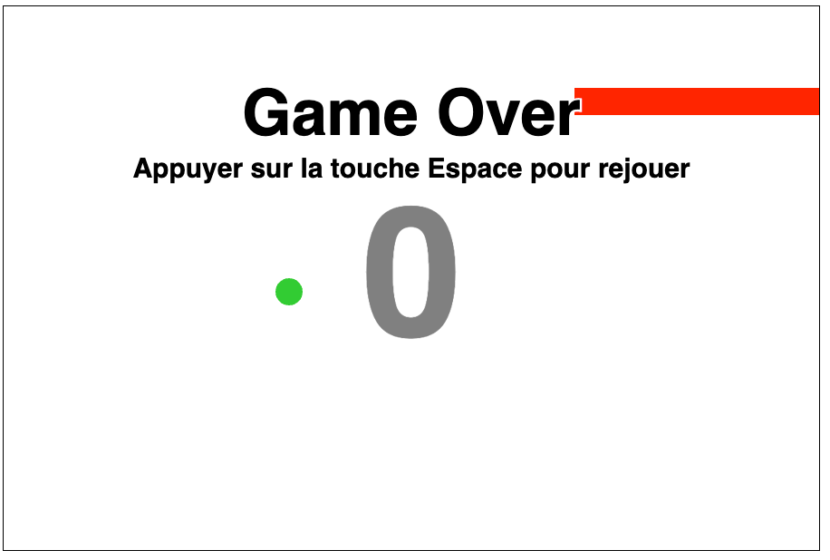

# Mythique jeu du serpent



## Utilisation du canvas


### 1. Initialisation

```js
window.onlad = function()
{
	// Création du canvas
	var canvas = document.createElement('canvas');

	// Dimensions
	canvas.width = 900;
	canvas.height = 600;
	// Style
	canvas.style.border = "1px solid";

	// Ajout du canvas au body
	document.body.appendChild(canvas);


	// ******** Dessiner dans le canvas

	// Récupération du contexte
	var ctx = canvas.getContext('2d');
	// Couleur de remplissage
	ctx.fillStyle = "#ff0000";

	// Remplissage avec un rectangle, ses coordonnées et ses dimensions
	ctx.fillRect(30, 30, 100, 50);
}
```

### 2. Amélioration et Timer

On va organiser le code, déclarer des variables globales et ajouter un timer

```js
window.onload = function()
{
	// Variables globales
	var canvas, ctx;
	var delay = 1000; // Delai en millisecondes
	var xCoord = 0;
	var yCoord = 0;

	// Appel de la fonction init
	init();

	// Initialisation du canvas
	function init()
	{
		// Création du canvas
		canvas = document.createElement('canvas');

		// Dimensions
		canvas.width = 900;
		canvas.height = 600;
		// Style
		canvas.style.border = "1px solid";

		// Ajout du canvas au body
		document.body.appendChild(canvas);


		// ******** Dessiner dans le canvas

		// Récupération du contexte
		ctx = canvas.getContext('2d');

		// Appel de la fonction de refresh
		refreshCanvas();
	}


	// Refresh du canvas
	function refreshCanvas()
	{
		// Nettoyage du canvas
		ctx.clearRect(0, 0, canvas.width, canvas.height);

		// Update des coords
		xCoord += 2;
		yCoord += 2;

		// Couleur de remplissage
		ctx.fillStyle = "#ff0000";

		// Remplissage avec un rectangle, ses coordonnées et ses dimensions
		ctx.fillRect(xCoord, yCoord, 100, 50);

		// ******* Mise en place d'un timer
		setTimeout(refreshCanvas, delay);
	}

}
```

### 3. Mouvement du serpent

Ici, on va ajouter la capacité du serpent à évoluer dans l'espace.

```js
window.onload = function()
{
	// Variables globales
	var canvasWidth = 900;
	var canvasHeight = 600;
	var blocksize = 30;
	var canvas, ctx;
	var delay = 1000; // Delai en millisecondes
	var xCoord = 0;
	var yCoord = 0;
	var snake;

	// Appel de la fonction init
	init();

	// Initialisation du canvas
	function init()
	{
		// Création du canvas
		canvas = document.createElement('canvas');

		// Dimensions
		canvas.width = canvasWidth;
		canvas.height = canvasHeight;
		// Style
		canvas.style.border = "1px solid";

		// Ajout du canvas au body
		document.body.appendChild(canvas);


		// ******** Dessiner dans le canvas

		// Récupération du contexte
		ctx = canvas.getContext('2d');

		// Construction du serpent
		snake = new Snake([	[5, 3], [6, 3], [7,3] ]);

		// Appel de la fonction de refresh
		refreshCanvas();
	}


	// Refresh du canvas
	function refreshCanvas()
	{
		// Nettoyage du canvas
		ctx.clearRect(0, 0, canvas.width, canvas.height);

		// Avancement du serpent
		snake.move();

		// Dessin du serpent
		snake.draw();

		// ******* Mise en place d'un timer
		setTimeout(refreshCanvas, delay);
	}
	function drawBlock (ctx, position)
	{
		// Détermination en pixels de la position
		var x = position[0] * blocksize;
		var y = position[1] * blocksize;

		// Remplissage du block avec les coordonnées calculées
		ctx.fillRect(x, y, blocksize, blocksize);
	}

	// Objet Serpent
	function Snake(body)
	{
		this.body = body;

		// Méthode draw
		this.draw = function ()
		{
			// Sauvegarde du contexte
			ctx.save();

			// Couleur de remplissage
			ctx.fillStyle = "#ff0000";

			// Boucle
			// Le corps du serpent sera un ensembl de petits rectangles
			for (var i=0; i < this.body.length; i++)
			{
				drawBlock(ctx, this.body[i]);
			}
			ctx.restore();
		}

		// Méthode pour faire avancer le serpent
		this.move = function()
		{
			// Récupération de la position de la tête du serpent
			var nextHeadPosition = this.body[0].slice();

			// Avancement de 1 de la tête
			nextHeadPosition[0] += 1;

			// On ajoute cette nouvelle position au courps du serpent
			// unshift ajoute en première case
			this.body.unshift( nextHeadPosition );

			// Retrait de la queue du serpent
			this.body.pop();
		}
	}

}
```

### 4. Diriger le serpent avec le clavier

Souci si le serpent revient sur ses pas!
On va gérer les événements clavier
Ajouter la prise en compte du changement de direction

```js
window.onload = function()
{
	// Variables globales
	var canvasWidth = 900;
	var canvasHeight = 600;
	var blocksize = 30;
	var canvas, ctx;
	var delay = 1000; // Delai en millisecondes
	var xCoord = 0;
	var yCoord = 0;
	var snake;

	// Appel de la fonction init
	init();

	// Initialisation du canvas
	function init()
	{
		// Création du canvas
		canvas = document.createElement('canvas');

		// Dimensions
		canvas.width = canvasWidth;
		canvas.height = canvasHeight;
		// Style
		canvas.style.border = "1px solid";

		// Ajout du canvas au body
		document.body.appendChild(canvas);


		// ******** Dessiner dans le canvas

		// Récupération du contexte
		ctx = canvas.getContext('2d');

		// Construction du serpent avec son body, et maintenant sa direction
		snake = new Snake([	[5, 3], [6, 3], [7,3] ], "right");

		// Appel de la fonction de refresh
		refreshCanvas();
	}


	// Refresh du canvas
	function refreshCanvas()
	{
		// Nettoyage du canvas
		ctx.clearRect(0, 0, canvas.width, canvas.height);

		// Avancement du serpent
		snake.move();

		// Dessin du serpent
		snake.draw();

		// ******* Mise en place d'un timer
		setTimeout(refreshCanvas, delay);
	}
	function drawBlock (ctx, position)
	{
		// Détermination en pixels de la position
		var x = position[0] * blocksize;
		var y = position[1] * blocksize;

		// Remplissage du block avec les coordonnées calculées
		ctx.fillRect(x, y, blocksize, blocksize);
	}

	// Objet Serpent
	function Snake(body, direction)
	{
		// Propriétés du serpent
		this.body = body;
		this.direction = direction

		// Méthode draw
		this.draw = function ()
		{
			// Sauvegarde du contexte
			ctx.save();

			// Couleur de remplissage
			ctx.fillStyle = "#ff0000";

			// Boucle
			// Le corps du serpent sera un ensembl de petits rectangles
			for (var i=0; i < this.body.length; i++)
			{
				drawBlock(ctx, this.body[i]);
			}
			ctx.restore();
		}

		// Méthode pour faire avancer le serpent
		this.move = function()
		{
			// Récupération de la position de la tête du serpent
			var nextHeadPosition = this.body[0].slice();

			// Quelle direction?
			switch (this.direction)
			{
				case "left":
					// Avancement de -1 de la tête sur l'axe X
					nextHeadPosition[0] -= 1;
					break;
				case "right":
					// Avancement de 1 de la tête sur l'axe X
					nextHeadPosition[0] += 1;
					break;
				case "up":
					// Avancement de -1 de la tête sur l'axe Y
					nextHeadPosition[1] -= 1;
					break;
				case "down":
					// Avancement de 1 de la tête sur l'axe Y
					nextHeadPosition[1] += 1;
					break;
				default:
					throw("Invalid direction");
			}

			// On ajoute cette nouvelle position au courps du serpent
			// unshift ajoute en première case
			this.body.unshift( nextHeadPosition );

			// Retrait de la queue du serpent
			this.body.pop();
		}

		// Méthode piur changer la direction
		this.setDirection = function ( newDirection )
		{
			var allowedDirections;
			// Quelle direction sont permises?
			switch (this.direction)
			{
				case "left":
				case "right":
					allowedDirections = ["up", "down"];
					break;
				case "up":
				case "down":
					allowedDirections = ["left", "right"];
					break;
				default:
					throw("Invalid direction");
			}

			// Avant de changer la direction on regarde le contenu du tableau allowedDirections avec la fonction indexOf
			if (allowedDirections.indexOf( newDirection ) > -1)
			{
				this.direction = newDirection;
			}
		}
	}

	// Evénements du clavier
	document.addEventListener('keydown', handleKeydown);

	function handleKeydown( ev )
	{
		var key = ev.key;

		var newDirection;
		switch (key)
		{
			case "ArrowLeft":
				newDirection = "left";
				break;
			case "ArrowUp":
				newDirection = "up";
				break;
			case "ArrowRight":
				newDirection = "right";
				break;
			case "ArrowDown":
				newDirection = "down";
				break;
			default:
				throw("Invalid code");
		}

		// On applique le mouvement au serpent
		snake.setDirection(newDirection);
	}
}
```

### 5. Ajouter la pomme

Le serpent fonctionne, se déplace en fonction du clavier.
On ajoute une pomme dans le canvas.

```js
window.onload = function()
{
	// Variables globales
	var canvasWidth = 900;
	var canvasHeight = 600;
	var blocksize = 30;
	var canvas, ctx;
	var delay = 1000; // Delai en millisecondes
	var snake;
	var apple;

	// Appel de la fonction init
	init();

	// Initialisation du canvas et des objets
	function init()
	{
		// Création du canvas
		canvas = document.createElement('canvas');

		// Dimensions
		canvas.width = canvasWidth;
		canvas.height = canvasHeight;
		// Style
		canvas.style.border = "1px solid";

		// Ajout du canvas au body
		document.body.appendChild(canvas);


		// ******** Dessiner dans le canvas

		// Récupération du contexte
		ctx = canvas.getContext('2d');

		// Construction du serpent avec son body, et maintenant sa direction
		snake = new Snake([	[5, 3], [6, 3], [7,3] ], "right");

		apple = new Apple([10,10]);

		// Appel de la fonction de refresh
		refreshCanvas();
	}

	// Refresh du canvas
	function refreshCanvas()
	{
		// Nettoyage du canvas
		ctx.clearRect(0, 0, canvas.width, canvas.height);

		// Avancement du serpent
		snake.move();

		// Dessin du serpent
		snake.draw();

		apple.draw();

		// ******* Mise en place d'un timer
		setTimeout(refreshCanvas, delay);
	}
	function drawBlock (ctx, position)
	{
		// Détermination en pixels de la position
		var x = position[0] * blocksize;
		var y = position[1] * blocksize;

		// Remplissage du block avec les coordonnées calculées
		ctx.fillRect(x, y, blocksize, blocksize);
	}

	// Objet Serpent
	function Snake(body, direction)
	{
		// Propriétés du serpent
		this.body = body;
		this.direction = direction

		// Méthode draw
		this.draw = function ()
		{
			// Sauvegarde du contexte
			ctx.save();

			// Couleur de remplissage
			ctx.fillStyle = "#ff0000";

			// Boucle
			// Le corps du serpent sera un ensembl de petits rectangles
			for (var i=0; i < this.body.length; i++)
			{
				drawBlock(ctx, this.body[i]);
			}
			ctx.restore();
		}

		// Méthode pour faire avancer le serpent
		this.move = function()
		{
			// Récupération de la position de la tête du serpent
			var nextHeadPosition = this.body[0].slice();

			// Quelle direction?
			switch (this.direction)
			{
				case "left":
					// Avancement de -1 de la tête sur l'axe X
					nextHeadPosition[0] -= 1;
					break;
				case "right":
					// Avancement de 1 de la tête sur l'axe X
					nextHeadPosition[0] += 1;
					break;
				case "up":
					// Avancement de -1 de la tête sur l'axe Y
					nextHeadPosition[1] -= 1;
					break;
				case "down":
					// Avancement de 1 de la tête sur l'axe Y
					nextHeadPosition[1] += 1;
					break;
				default:
					throw("Invalid direction");
			}

			// On ajoute cette nouvelle position au courps du serpent
			// unshift ajoute en première case
			this.body.unshift( nextHeadPosition );

			// Retrait de la queue du serpent
			this.body.pop();
		}

		// Méthode piur changer la direction
		this.setDirection = function ( newDirection )
		{
			var allowedDirections;
			// Quelle direction sont permises?
			switch (this.direction)
			{
				case "left":
				case "right":
					allowedDirections = ["up", "down"];
					break;
				case "up":
				case "down":
					allowedDirections = ["left", "right"];
					break;
				default:
					throw("Invalid direction");
			}

			// Avant de changer la direction on regarde le contenu du tableau allowedDirections avec la fonction indexOf
			if (allowedDirections.indexOf( newDirection ) > -1)
			{
				this.direction = newDirection;
			}
		}
	}

	// Objet Pomme
	// La position doit etre le milieu d'un bloc!
	function Apple (position)
	{
		this.position = position;

		this.draw = function ()
		{
			// Sauvegarde du contexte
			ctx.save();

			// Couleur de remplissage
			ctx.fillStyle = "#33cc33";

			ctx.beginPath();
			// Le rayon correspond à la moitié d'un bloc
			var radius = blocksize / 2;
			// La position doit etre le milieu d'un bloc!
			var x = position[0] * blocksize + radius;
			var y = position[1] * blocksize + radius;

			// Fonction qui va dessiner le cercle
			ctx.arc(x, y, radius, 0, Math.PI *2, true);

			ctx.fill();

			ctx.restore();
		}
	}

	// Evénements du clavier
	document.addEventListener('keydown', handleKeydown);
	function handleKeydown( ev )
	{
		var key = ev.key;

		var newDirection;
		switch (key)
		{
			case "ArrowLeft":
				newDirection = "left";
				break;
			case "ArrowUp":
				newDirection = "up";
				break;
			case "ArrowRight":
				newDirection = "right";
				break;
			case "ArrowDown":
				newDirection = "down";
				break;
			default:
				throw("Invalid code");
		}

		// On applique le mouvement au serpent
		snake.setDirection(newDirection);
	}
}
```

### 6. Limites des murs et de lui même

Le serpent ne peut pas dépasser le mur, s'il touche les bords, c'est perdu!

De même, si le serpent se mange lui même, c'est perdu.

Définition de la largeur en terme de block et non en pixel

On détecte la collision de la tête uniquement contre les murs et contre son propre corps

Pour tester la collision avec le corps, il aura fallu allonger le corps.
On peut aussi modifier le délai pour ajuster la vitesse du serpent

```js
window.onload = function()
{
	// Variables globales
	var canvasWidth = 900;
	var canvasHeight = 600;
	var blocksize = 30;
	var canvas, ctx;
	var delay = 100; // Delai en millisecondes
	var snake;
	var apple;

	// Définition de la largeur en terme de block et non en pixel
	var widthInBlock = canvasWidth / blocksize;
	var heightInBlock = canvasHeight / blocksize;

	// Appel de la fonction init
	init();

	// Initialisation du canvas et des objets
	function init()
	{
		// Création du canvas
		canvas = document.createElement('canvas');

		// Dimensions
		canvas.width = canvasWidth;
		canvas.height = canvasHeight;
		// Style
		canvas.style.border = "1px solid";

		// Ajout du canvas au body
		document.body.appendChild(canvas);


		// ******** Dessiner dans le canvas

		// Récupération du contexte
		ctx = canvas.getContext('2d');

		// Construction du serpent avec son body, et maintenant sa direction
		snake = new Snake([ [9, 3], [8, 3], [7, 3], [6, 3],	[5, 3], [4, 3], [4,3], [4,3], [1,3] ], "right");

		apple = new Apple([10,10]);

		// Appel de la fonction de refresh
		refreshCanvas();
	}

	// Refresh du canvas
	function refreshCanvas()
	{
		// Avancement du serpent
		snake.move();

		// On vérifie la collision
		if ( snake.checkCollision() )
		{
			// Game over
			console.log("gameover");
		}else{
			// Nettoyage du canvas
			ctx.clearRect(0, 0, canvas.width, canvas.height);

			// Dessin du serpent
			snake.draw();

			// Dessin de la pomme
			apple.draw();

			// ******* Mise en place d'un timer
			setTimeout(refreshCanvas, delay);
		}
	}
	function drawBlock (ctx, position)
	{
		// Détermination en pixels de la position
		var x = position[0] * blocksize;
		var y = position[1] * blocksize;

		// Remplissage du block avec les coordonnées calculées
		ctx.fillRect(x, y, blocksize, blocksize);
	}

	// Objet Serpent
	function Snake(body, direction)
	{
		// Propriétés du serpent
		this.body = body;
		this.direction = direction

		// Méthode draw
		this.draw = function ()
		{
			// Sauvegarde du contexte
			ctx.save();

			// Couleur de remplissage
			ctx.fillStyle = "#ff0000";

			// Boucle
			// Le corps du serpent sera un ensembl de petits rectangles
			for (var i=0; i < this.body.length; i++)
			{
				drawBlock(ctx, this.body[i]);
			}
			ctx.restore();
		}

		// Méthode pour faire avancer le serpent
		this.move = function()
		{
			// Récupération de la position de la tête du serpent
			var nextHeadPosition = this.body[0].slice();

			// Quelle direction?
			switch (this.direction)
			{
				case "left":
					// Avancement de -1 de la tête sur l'axe X
					nextHeadPosition[0] -= 1;
					break;
				case "right":
					// Avancement de 1 de la tête sur l'axe X
					nextHeadPosition[0] += 1;
					break;
				case "up":
					// Avancement de -1 de la tête sur l'axe Y
					nextHeadPosition[1] -= 1;
					break;
				case "down":
					// Avancement de 1 de la tête sur l'axe Y
					nextHeadPosition[1] += 1;
					break;
				default:
					throw("Invalid direction");
			}

			// On ajoute cette nouvelle position au courps du serpent
			// unshift ajoute en première case
			this.body.unshift( nextHeadPosition );

			// Retrait de la queue du serpent
			this.body.pop();
		}

		// Méthode pour changer la direction
		this.setDirection = function ( newDirection )
		{
			var allowedDirections;
			// Quelle direction sont permises?
			switch (this.direction)
			{
				case "left":
				case "right":
					allowedDirections = ["up", "down"];
					break;
				case "up":
				case "down":
					allowedDirections = ["left", "right"];
					break;
				default:
					throw("Invalid direction");
			}

			// Avant de changer la direction on regarde le contenu du tableau allowedDirections avec la fonction indexOf
			if (allowedDirections.indexOf( newDirection ) > -1)
			{
				this.direction = newDirection;
			}
		}

		// Méthode pour vérifier les collisions
		this.checkCollision = function ()
		{
			// Collision sur un mur
			var wallCollision = false;

			// collision sur lui même
			var selfCollision = false;

			// On a besoin de tester uniquement la tête, c'est la tête qui entre en collision!
			var headSnake = this.body[0]; // headSnake est donc un tableau de coordonnées
			var bodySnake = this.body.slice(1); // On coupe à partir de la case 1

			// Test de la collision avec un mur
			if (
				// Mur de droite
				headSnake[0] >= widthInBlock ||
				// Mur de gauche
				headSnake[0] < 0 ||
				// Mur du haut
				headSnake[1] < 0 ||
				// Mur du bas
				headSnake[1] >= heightInBlock
			)
			{
				console.log("wall");
				wallCollision = true;
			}

			// Test de la collision avec son propre corps
			for ( var i=0; i < bodySnake.length; i++ )
			{
				if (
					headSnake[0] === bodySnake[i][0] &&
					headSnake[1] === bodySnake[i][1]
				)
				{
					selfCollision = true;
				}
			}

			return wallCollision || selfCollision;
		}
	}

	// Objet Pomme
	// La position doit etre le milieu d'un bloc!
	function Apple (position)
	{
		this.position = position;

		this.draw = function ()
		{
			// Sauvegarde du contexte
			ctx.save();

			// Couleur de remplissage
			ctx.fillStyle = "#33cc33";

			ctx.beginPath();
			// Le rayon correspond à la moitié d'un bloc
			var radius = blocksize / 2;
			// La position doit etre le milieu d'un bloc!
			var x = this.position[0] * blocksize + radius;
			var y = this.position[1] * blocksize + radius;

			// Fonction qui va dessiner le cercle
			ctx.arc(x, y, radius, 0, Math.PI *2, true);

			ctx.fill();

			ctx.restore();
		}
	}

	// Evénements du clavier
	document.addEventListener('keydown', handleKeydown);
	function handleKeydown( ev )
	{
		var key = ev.key;

		var newDirection;
		switch (key)
		{
			case "ArrowLeft":
				newDirection = "left";
				break;
			case "ArrowUp":
				newDirection = "up";
				break;
			case "ArrowRight":
				newDirection = "right";
				break;
			case "ArrowDown":
				newDirection = "down";
				break;
			default:
				throw("Invalid code");
		}

		// On applique le mouvement au serpent
		snake.setDirection(newDirection);
	}
}
```

### 7. Le serpent a t'il mangé la pomme?

Ajustez la longueur du corps, et la vitesse.

On va ajouter une méthode de test de pomme mangée

Et on appelle cette nouvelle methode dans refreshCanvas

Si la pomme est mangée, on va la déplacer!
On pourrait aussi ajouter des points, allonger le serpent...

Il faut aussi vérifier que la pomme n'est pas repositionnée sur le corps du serpent

```js
window.onload = function()
{
	// Variables globales
	var canvasWidth = 900;
	var canvasHeight = 600;
	var blocksize = 30;
	var canvas, ctx;
	var delay = 300; // Delai en millisecondes
	var snake;
	var apple;

	// Définition de la largeur en terme de block et non en pixel
	var widthInBlock = canvasWidth / blocksize;
	var heightInBlock = canvasHeight / blocksize;

	// Appel de la fonction init
	init();

	// Initialisation du canvas et des objets
	function init()
	{
		// Création du canvas
		canvas = document.createElement('canvas');

		// Dimensions
		canvas.width = canvasWidth;
		canvas.height = canvasHeight;
		// Style
		canvas.style.border = "1px solid";

		// Ajout du canvas au body
		document.body.appendChild(canvas);


		// ******** Dessiner dans le canvas

		// Récupération du contexte
		ctx = canvas.getContext('2d');

		// Construction du serpent avec son body, et maintenant sa direction
		snake = new Snake([ [9, 3], [8, 3], [7, 3], [6, 3],	[5, 3], [4, 3], [4,3], [4,3], [1,3] ], "right");

		apple = new Apple([10,10]);

		// Appel de la fonction de refresh
		refreshCanvas();
	}

	// Refresh du canvas
	function refreshCanvas()
	{
		// Avancement du serpent
		snake.move();

		// On vérifie la collision
		if ( snake.checkCollision() )
		{
			// Game over
			console.log("gameover");
		}else{
			// Pomme mangée?
			if ( snake.isEatingApple(apple) ){
				// La pomme est mangée!
				console.log("Pomme mangée");

				// On replace la pomme si elle est par hasard sur le corps du serpent
				do{
					// Déplacement de la pomme
					apple.setNewPosition();
				}
				while( apple.isOnSnake(snake) );
			}

			// Nettoyage du canvas
			ctx.clearRect(0, 0, canvas.width, canvas.height);

			// Dessin du serpent
			snake.draw();

			// Dessin de la pomme
			apple.draw();

			// ******* Mise en place d'un timer
			setTimeout(refreshCanvas, delay);
		}
	}
	function drawBlock (ctx, position)
	{
		// Détermination en pixels de la position
		var x = position[0] * blocksize;
		var y = position[1] * blocksize;

		// Remplissage du block avec les coordonnées calculées
		ctx.fillRect(x, y, blocksize, blocksize);
	}

	// Objet Serpent
	function Snake(body, direction)
	{
		// Propriétés du serpent
		this.body = body;
		this.direction = direction

		// Méthode draw
		this.draw = function ()
		{
			// Sauvegarde du contexte
			ctx.save();

			// Couleur de remplissage
			ctx.fillStyle = "#ff0000";

			// Boucle
			// Le corps du serpent sera un ensembl de petits rectangles
			for (var i=0; i < this.body.length; i++)
			{
				drawBlock(ctx, this.body[i]);
			}
			ctx.restore();
		}

		// Méthode pour faire avancer le serpent
		this.move = function()
		{
			// Récupération de la position de la tête du serpent
			var nextHeadPosition = this.body[0].slice();

			// Quelle direction?
			switch (this.direction)
			{
				case "left":
					// Avancement de -1 de la tête sur l'axe X
					nextHeadPosition[0] -= 1;
					break;
				case "right":
					// Avancement de 1 de la tête sur l'axe X
					nextHeadPosition[0] += 1;
					break;
				case "up":
					// Avancement de -1 de la tête sur l'axe Y
					nextHeadPosition[1] -= 1;
					break;
				case "down":
					// Avancement de 1 de la tête sur l'axe Y
					nextHeadPosition[1] += 1;
					break;
				default:
					throw("Invalid direction");
			}

			// On ajoute cette nouvelle position au courps du serpent
			// unshift ajoute en première case
			this.body.unshift( nextHeadPosition );

			// Retrait de la queue du serpent
			this.body.pop();
		}

		// Méthode pour changer la direction
		this.setDirection = function ( newDirection )
		{
			var allowedDirections;
			// Quelle direction sont permises?
			switch (this.direction)
			{
				case "left":
				case "right":
					allowedDirections = ["up", "down"];
					break;
				case "up":
				case "down":
					allowedDirections = ["left", "right"];
					break;
				default:
					throw("Invalid direction");
			}

			// Avant de changer la direction on regarde le contenu du tableau allowedDirections avec la fonction indexOf
			if (allowedDirections.indexOf( newDirection ) > -1)
			{
				this.direction = newDirection;
			}
		}

		// Méthode pour vérifier les collisions
		this.checkCollision = function ()
		{
			// Collision sur un mur
			var wallCollision = false;

			// collision sur lui même
			var selfCollision = false;

			// On a besoin de tester uniquement la tête, c'est la tête qui entre en collision!
			var headSnake = this.body[0]; // headSnake est donc un tableau de coordonnées
			var bodySnake = this.body.slice(1); // On coupe à partir de la case 1

			// Test de la collision avec un mur
			if (
				// Mur de droite
				headSnake[0] >= widthInBlock ||
				// Mur de gauche
				headSnake[0] < 0 ||
				// Mur du haut
				headSnake[1] < 0 ||
				// Mur du bas
				headSnake[1] >= heightInBlock
			)
			{
				console.log("wall");
				wallCollision = true;
			}

			// Test de la collision avec son propre corps
			for ( var i=0; i < bodySnake.length; i++ )
			{
				if (
					headSnake[0] === bodySnake[i][0] &&
					headSnake[1] === bodySnake[i][1]
				)
				{
					selfCollision = true;
				}
			}

			return wallCollision || selfCollision;
		}

		// Méthode de détection de pomme mangée
		this.isEatingApple = function ( apple )
		{
			// Récupération de la tête du serpent
			var headSnake = this.body[0];

			// Test de correspondance des coordonnées de la pomme et de la tête
			if ( headSnake[0] == apple.position[0] // Coordonnées X
				&&
				headSnake[1] == apple.position[1] // Coordonnées Y
			){
				return true;
			}else{
				return false;
			}
		}
	}

	// Objet Pomme
	// La position doit etre le milieu d'un bloc!
	function Apple (position)
	{
		this.position = position;

		this.draw = function ()
		{
			// Sauvegarde du contexte
			ctx.save();

			// Couleur de remplissage
			ctx.fillStyle = "#33cc33";

			ctx.beginPath();
			// Le rayon correspond à la moitié d'un bloc
			var radius = blocksize / 2;
			// La position doit etre le milieu d'un bloc!
			var x = this.position[0] * blocksize + radius;
			var y = this.position[1] * blocksize + radius;

			// Fonction qui va dessiner le cercle
			ctx.arc(x, y, radius, 0, Math.PI *2, true);

			ctx.fill();

			ctx.restore();
		}

		// Méthode pour déplacer la pomme
		this.setNewPosition = function ()
		{
			// Nombre ENTIER au hasard entre 0 et widthInBlock -1, soit 29
			var newX = Math.round(Math.random() * (widthInBlock -1));
			var newY = Math.round(Math.random() * (heightInBlock -1));

			// Modification de la position de la pomme
			this.position = [newX, newY];
		}

		// Méthode pour vérifier que la pomme n'a pas été placée sur le corps du serpent!
		this.isOnSnake = function ( snake )
		{
			// Par défaut, à non
			var isOnSnake = false;

			// Parcours du corps du serpent
			for (var i=0; i<snake.body.length; i++)
			{
				// Test des positions
				if (
					this.position[0] == snake.body[i][0] // Test du X
					&&
					this.position[1] == snake.body[i][1] // Test du Y
				)
				{
					isOnSnake = true;
				}
			}

			return isOnSnake;
		}
	}

	// Evénements du clavier
	document.addEventListener('keydown', handleKeydown);
	function handleKeydown( ev )
	{
		var key = ev.key;

		var newDirection;
		switch (key)
		{
			case "ArrowLeft":
				newDirection = "left";
				break;
			case "ArrowUp":
				newDirection = "up";
				break;
			case "ArrowRight":
				newDirection = "right";
				break;
			case "ArrowDown":
				newDirection = "down";
				break;
			default:
				throw("Invalid code");
		}

		// On applique le mouvement au serpent
		snake.setDirection(newDirection);
	}
}
```

### 8. Allongement du serpent

Si je mande une pomme, on allonge le serpent

Ca va se placer vers:

```js
// Retrait de la queue du serpent
this.body.pop();
```

On va dire au serpent de ne pas retirer sa dernière case UNIQUEMENT si une pomme a été mangée!

On modifie donc uniquement la classe serpent:

```js
// Objet Serpent
function Snake(body, direction)
{
	// Propriétés du serpent
	this.body = body;
	this.direction = direction
	this.ateApple = false;		// Au cas où le serpent viet de manger une pomme

	// Méthode draw
	this.draw = function ()
	{
		// Sauvegarde du contexte
		ctx.save();

		// Couleur de remplissage
		ctx.fillStyle = "#ff0000";

		// Boucle
		// Le corps du serpent sera un ensembl de petits rectangles
		for (var i=0; i < this.body.length; i++)
		{
			drawBlock(ctx, this.body[i]);
		}
		ctx.restore();
	}

	// Méthode pour faire avancer le serpent
	this.move = function()
	{
		// Récupération de la position de la tête du serpent
		var nextHeadPosition = this.body[0].slice();

		// Quelle direction?
		switch (this.direction)
		{
			case "left":
				// Avancement de -1 de la tête sur l'axe X
				nextHeadPosition[0] -= 1;
				break;
			case "right":
				// Avancement de 1 de la tête sur l'axe X
				nextHeadPosition[0] += 1;
				break;
			case "up":
				// Avancement de -1 de la tête sur l'axe Y
				nextHeadPosition[1] -= 1;
				break;
			case "down":
				// Avancement de 1 de la tête sur l'axe Y
				nextHeadPosition[1] += 1;
				break;
			default:
				throw("Invalid direction");
		}

		// On ajoute cette nouvelle position au courps du serpent
		// unshift ajoute en première case
		this.body.unshift( nextHeadPosition );

		// Retrait de la queue du serpent UNIQUEMENT si une pomme n'a pas été mangée
		if (!this.ateApple)
		{
			this.body.pop();
		}else{
			console.log("Allongement du serpent");
			// Réinitialisation
			this.ateApple = false;
		}
	}

	// Méthode pour changer la direction
	this.setDirection = function ( newDirection )
	{
		var allowedDirections;
		// Quelle direction sont permises?
		switch (this.direction)
		{
			case "left":
			case "right":
				allowedDirections = ["up", "down"];
				break;
			case "up":
			case "down":
				allowedDirections = ["left", "right"];
				break;
			default:
				throw("Invalid direction");
		}

		// Avant de changer la direction on regarde le contenu du tableau allowedDirections avec la fonction indexOf
		if (allowedDirections.indexOf( newDirection ) > -1)
		{
			this.direction = newDirection;
		}
	}

	// Méthode pour vérifier les collisions
	this.checkCollision = function ()
	{
		// Collision sur un mur
		var wallCollision = false;

		// collision sur lui même
		var selfCollision = false;

		// On a besoin de tester uniquement la tête, c'est la tête qui entre en collision!
		var headSnake = this.body[0]; // headSnake est donc un tableau de coordonnées
		var bodySnake = this.body.slice(1); // On coupe à partir de la case 1

		// Test de la collision avec un mur
		if (
			// Mur de droite
			headSnake[0] >= widthInBlock ||
			// Mur de gauche
			headSnake[0] < 0 ||
			// Mur du haut
			headSnake[1] < 0 ||
			// Mur du bas
			headSnake[1] >= heightInBlock
		)
		{
			console.log("wall");
			wallCollision = true;
		}

		// Test de la collision avec son propre corps
		for ( var i=0; i < bodySnake.length; i++ )
		{
			if (
				headSnake[0] === bodySnake[i][0] &&
				headSnake[1] === bodySnake[i][1]
			)
			{
				selfCollision = true;
			}
		}

		return wallCollision || selfCollision;
	}

	// Méthode de détection de pomme mangée
	this.isEatingApple = function ( apple )
	{
		// Récupération de la tête du serpent
		var headSnake = this.body[0];

		// Test de correspondance des coordonnées de la pomme et de la tête
		if ( headSnake[0] == apple.position[0] // Coordonnées X
			&&
			headSnake[1] == apple.position[1] // Coordonnées Y
		){
			// On définit cette propriété à true pour indiquer que le serpent vient de manger une pomme
			this.ateApple = true;
			return true;
		}else{
			return false;
		}
	}
}
```

### 9. Score, et Game Over

On va créer une fonction GameOver.
Elle va afficher à l'écran GameOver et un message pour relancer le jeu

```js
// Fonction d'affichage de fin de jeu
	function gameOver()
	{
		ctx.save();
		ctx.fillText("GAME OVER", canvasWidth /2 - 20, canvasHeight /2 -10);

		ctx.fillText("Press START to play again", canvasWidth /2 -20, canvasHeight /2);
		ctx.restore();
	}
```

Fonction de relance du jeu
```js
// Fonction relance le jeu appelée quand on appuie sur espace
	function resetGame()
	{
		// Recrée les objets serpent et pomme

		// Construction du serpent avec son body, et maintenant sa direction
		snake = new Snake([ [9, 3], [8, 3], [7, 3], [6, 3],	[5, 3], [4, 3], [4,3], [4,3], [1,3] ], "right");

		apple = new Apple([10,10]);

		// Appel de la fonction de refresh
		refreshCanvas();
	}
```


Modification de la prise en compte de la touche Espace
```js
// Evénements du clavier
	document.addEventListener('keydown', handleKeydown);
	function handleKeydown( ev )
	{
		var key = ev.keyCode;

		//console.log(key);

		var newDirection;
		// https://keyevents.netlify.app/
		switch (key)
		{
			case 37:
				newDirection = "left";
				break;
			case 38:
				newDirection = "up";
				break;
			case 39:
				newDirection = "right";
				break;
			case 40:
				newDirection = "down";
				break;
			case 32:
				resetGame();
				break;
			default:
				throw("Invalid code");
		}

		// On applique le mouvement au serpent
		snake.setDirection(newDirection);
	}
```

### 10. Améliorations

Vitesse du serpent, enregistrement des scores...

Modification des mots clés var en let ou const
Fonctions fléchées...

# Diagrammes

## Diagramme de classe


## Diagramme de séquence

```plantuml
@startuml
'https://plantuml.com/sequence-diagram
